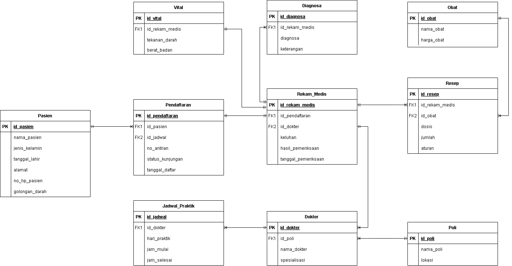

# db-rumahsakit
# 🏥 Sistem Informasi Rumah Sakit

## 📋 Deskripsi Project

**Sistem Informasi Rumah Sakit** adalah sistem basis data relasional yang dirancang untuk mendukung dan mengotomatisasi proses operasional rumah sakit secara menyeluruh. Sistem ini dibangun menggunakan **MySQL** dan mencakup pengelolaan:

- **Data Pasien** — identitas, golongan darah, kontak, dan riwayat kunjungan
- **Data Dokter & Poli** — spesialisasi, lokasi poli, dan jadwal praktik
- **Pendaftaran & Antrian** — pencatatan kunjungan pasien secara terstruktur
- **Rekam Medis** — keluhan, hasil pemeriksaan, tanda vital, dan diagnosa
- **Resep & Obat** — pemberian obat beserta dosis, jumlah, dan aturan pakai
- **Audit Log** — pencatatan otomatis setiap perubahan data pasien

Sistem ini dilengkapi dengan objek-objek SQL lanjutan seperti VIEW, STORED PROCEDURE, TRIGGER, dan FUNCTION untuk mendukung efisiensi, keamanan, dan integritas data secara menyeluruh.

---

## 👥 Anggota Tim

| No | Nama | NIM |
|----|------|-----|
| 1 | Nabila Alsa Haryanto | K1D024006 |
| 2 | Nayla Safira Aulia | K1D024012 |
| 3 | Meylina Nur Sasmita | K1D024017 |
| 4 | Naila Dwina Azzahra | K1D024020 |
| 5 | Chindy Renita Listiyana | K1D024039 |

---

## 🗂️ Struktur Folder

```
sistem-informasi-rumah-sakit/
│
├── 01_ddl.sql            # DDL: pembuatan database, tabel, constraint, dan index
├── 02_dml.sql            # DML: data dummy untuk seluruh tabel
├── 03_query.sql          # Query SELECT bertingkat (sederhana, JOIN, subquery, CTE, agregat)
├── 04_view.sql           # VIEW: view_riwayat_pasien & view_laporan_harian
├── 05_procedure.sql      # STORED PROCEDURE: riwayat_pasien
├── 06_trigger.sql        # TRIGGER: audit log otomatis tabel pasien
├── 07_function.sql       # FUNCTION: fn_hitung_usia & fn_total_biaya_obat
├── ERD_drawio.png        # Entity Relationship Diagram
└── README.md             # Dokumentasi project ini
```

### Penjelasan tiap file:

| File | Isi |
|------|-----|
| `01_ddl.sql` | Membuat database `db_rumah_sakit`, 10 tabel dengan PRIMARY KEY, FOREIGN KEY, dan 3 INDEX |
| `02_dml.sql` | Data dummy: 24 pasien, 6 dokter, 5 poli, 25 jadwal, 25 pendaftaran, 24 rekam medis, 7 obat, dst |
| `03_query.sql` | 10 query SELECT dengan kompleksitas bertingkat |
| `04_view.sql` | 2 VIEW siap pakai untuk keperluan rekap dan laporan |
| `05_procedure.sql` | 1 STORED PROCEDURE untuk menampilkan riwayat kunjungan pasien |
| `06_trigger.sql` | 3 TRIGGER audit log (INSERT, UPDATE, DELETE) pada tabel pasien |
| `07_function.sql` | 2 FUNCTION: menghitung usia pasien dan total biaya obat per rekam medis |

---

## 🗄️ ERD (Entity Relationship Diagram)



### Daftar Tabel

| Tabel | Primary Key | Deskripsi |
|-------|-------------|-----------|
| `poli` | id_poli | Data poli/unit layanan beserta lokasi di rumah sakit |
| `dokter` | id_dokter | Data dokter, spesialisasi, dan poli tempat bertugas |
| `pasien` | id_pasien | Identitas lengkap pasien (nama, JK, tgl lahir, alamat, no HP, gol darah) |
| `jadwal` | id_jadwal | Jadwal praktik dokter (hari, jam mulai, jam selesai) |
| `pendaftaran` | id_pendaftaran | Data kunjungan pasien (nomor antrian, tanggal daftar, status kunjungan) |
| `rekam_medis` | id_rekam_medis | Hasil pemeriksaan, keluhan, dan tanggal periksa |
| `vital` | id_vital | Tanda vital pasien (tekanan darah, berat badan) |
| `diagnosa` | id_diagnosa | Diagnosa penyakit dan keterangan dari dokter |
| `resep` | id_resep | Resep obat (dosis, jumlah, aturan pakai) |
| `obat` | id_obat | Data obat dan harga satuan |

### Relasi Antar Tabel

```
Pasien ──< Pendaftaran >── Jadwal >── Dokter >── Poli
                │
                └──< Rekam_Medis ──>── Vital
                          │        └──> Diagnosa
                          │
                          └──< Resep >── Obat
```

---

## 📁 Penjelasan Query & Objek SQL

### 🔍 03_query.sql — 10 Query SELECT

**3 Query Sederhana**

| No | Fungsi |
|----|--------|
| 1 | Menampilkan seluruh data pasien (`SELECT * FROM pasien`) |
| 2 | Menampilkan dokter spesialis Penyakit Dalam |
| 3 | Menampilkan obat dengan harga di atas Rp4.000 |

**4 Query dengan JOIN (minimal 3 tabel)**

| No | Fungsi | Tabel yang Digabung |
|----|--------|---------------------|
| 1 | Data pendaftaran beserta dokter yang menangani | `pendaftaran`, `pasien`, `jadwal`, `dokter` |
| 2 | Riwayat pemeriksaan pasien | `rekam_medis`, `pendaftaran`, `pasien`, `dokter` |
| 3 | Resep obat yang diterima tiap pasien | `resep`, `obat`, `rekam_medis`, `pendaftaran`, `pasien` |
| 4 | Dokter beserta poli dan jadwal praktiknya | `dokter`, `poli`, `jadwal` |

**2 Query Subquery & CTE**

| No | Jenis | Fungsi |
|----|-------|--------|
| 1 | SUBQUERY | Mencari pasien yang pernah berobat lebih dari 1 kali |
| 2 | CTE | Menghitung total kunjungan tiap dokter dari tabel rekam_medis |

**1 Query Agregat GROUP BY + HAVING**
- Menampilkan dokter yang menangani lebih dari 3 pasien

---

### 👁️ 04_view.sql — VIEW

| VIEW | Fungsi |
|------|--------|
| `view_riwayat_pasien` | Menggabungkan data pasien, rekam medis, diagnosa, resep obat, dokter, dan poli dalam satu tampilan lengkap — cocok untuk halaman riwayat medis pasien |
| `view_laporan_harian` | Merangkum jumlah pasien, rekam medis, diagnosa, resep, dan total nilai resep per tanggal per dokter per poli — cocok untuk laporan harian administrasi |

Contoh penggunaan:
```sql
-- Lihat riwayat lengkap satu pasien
SELECT * FROM view_riwayat_pasien WHERE id_pasien = 'PA01';

-- Lihat laporan harian tanggal tertentu
SELECT * FROM view_laporan_harian WHERE tanggal = '2026-01-20';
```

---

### ⚙️ 05_procedure.sql — STORED PROCEDURE

| Procedure | Parameter | Fungsi |
|-----------|-----------|--------|
| `riwayat_pasien` | `IN p_id_pasien VARCHAR(10)` | Menampilkan riwayat kunjungan lengkap seorang pasien: nama, tanggal periksa, keluhan, hasil pemeriksaan, dan diagnosa |

Cara memanggil:
```sql
CALL riwayat_pasien('PA20');
```

---

### ⚡ 06_trigger.sql — TRIGGER

Sebelum trigger dibuat, sistem membuat tabel `audit_log` terlebih dahulu untuk menyimpan semua log perubahan data.

| Trigger | Event | Fungsi |
|---------|-------|--------|
| `tr_audit_pasien_insert` | `AFTER INSERT` pada `pasien` | Mencatat data pasien baru yang ditambahkan ke audit_log |
| `tr_audit_pasien_update` | `AFTER UPDATE` pada `pasien` | Mencatat data lama dan data baru ketika data pasien diubah |
| `tr_audit_pasien_delete` | `AFTER DELETE` pada `pasien` | Mencatat data pasien yang dihapus beserta siapa yang menghapus |

Setiap log menyimpan: nama tabel, jenis aksi, ID data, data sebelum/sesudah perubahan, username pelaku, dan waktu kejadian.

Alur kerja trigger:
```
Ada perubahan di tabel pasien          audit_log
  (INSERT / UPDATE / DELETE)   →→→    otomatis terisi!
                              TRIGGER jalan sendiri
```

---

### 🔧 07_function.sql — FUNCTION

| Function | Parameter | Return | Fungsi |
|----------|-----------|--------|--------|
| `fn_hitung_usia` | `p_tgl_lahir DATE` | `INT` | Menghitung usia pasien dalam tahun berdasarkan tanggal lahir, dengan pengecekan apakah sudah melewati hari ulang tahun di tahun berjalan |
| `fn_total_biaya_obat` | `p_id_rekam_medis VARCHAR(10)` | `DECIMAL(12,2)` | Menghitung total biaya obat dari suatu rekam medis (jumlah obat × harga satuan, semua item resep dijumlahkan) |

Contoh penggunaan:
```sql
-- Tampilkan pasien beserta usianya
SELECT nama_pasien, tgl_lahir, fn_hitung_usia(tgl_lahir) AS usia
FROM pasien
WHERE fn_hitung_usia(tgl_lahir) > 20;

-- Tampilkan total biaya obat tiap pasien
SELECT rm.id_rekam_medis, p.nama_pasien,
       fn_total_biaya_obat(rm.id_rekam_medis) AS total_biaya_obat
FROM rekam_medis rm
JOIN pendaftaran pf ON rm.id_pendaftaran = pf.id_pendaftaran
JOIN pasien p ON pf.id_pasien = p.id_pasien;
```

---

## ▶️ Cara Menjalankan Script

### Prasyarat
- **MySQL Workbench** sudah terinstall di komputer
- **MySQL Server** sudah berjalan (ikon koneksi berwarna hijau di MySQL Workbench)

### Langkah-langkah

**Langkah 1 — Buka MySQL Workbench**

Buka MySQL Workbench dan klik koneksi MySQL lokal (biasanya `root@localhost`).

**Langkah 2 — Jalankan script secara berurutan**

> ⚠️ **Urutan ini wajib diikuti!** File `01_ddl.sql` sudah membuat database `db_rumah_sakit` secara otomatis, sehingga tidak perlu membuat database manual.

```
01_ddl.sql          ← Buat database & semua tabel
      ↓
02_dml.sql          ← Isi data dummy
      ↓
03_query.sql        ← Jalankan query SELECT
      ↓
04_view.sql         ← Buat VIEW
      ↓
05_procedure.sql    ← Buat Stored Procedure
      ↓
06_trigger.sql      ← Buat Trigger & tabel audit_log
      ↓
07_function.sql     ← Buat Function
```

Cara membuka dan menjalankan tiap file:
1. Klik **File → Open SQL Script**
2. Pilih file `.sql` yang ingin dijalankan
3. Tekan **Ctrl + Shift + Enter** untuk menjalankan seluruh isi file
4. Pastikan tidak ada pesan error di panel **Output** bagian bawah
5. Ulangi untuk file berikutnya sesuai urutan

**Langkah 3 — Verifikasi database**

Setelah semua file dijalankan, cek tabel yang terbentuk:
```sql
USE db_rumah_sakit;
SHOW TABLES;
```

Output yang diharapkan:
```
+-------------------------+
| Tables_in_db_rumah_sakit|
+-------------------------+
| audit_log               |
| diagnosa                |
| dokter                  |
| jadwal                  |
| obat                    |
| pasien                  |
| pendaftaran             |
| poli                    |
| rekam_medis             |
| resep                   |
| vital                   |
+-------------------------+
```

**Langkah 4 — Coba jalankan contoh query**

```sql
-- Cek data pasien
SELECT * FROM pasien LIMIT 5;

-- Cek VIEW riwayat pasien
SELECT * FROM view_riwayat_pasien WHERE id_pasien = 'PA01';

-- Cek laporan harian
SELECT * FROM view_laporan_harian;

-- Panggil stored procedure
CALL riwayat_pasien('PA20');

-- Cek function usia
SELECT nama_pasien, fn_hitung_usia(tgl_lahir) AS usia FROM pasien;
```

---

```
